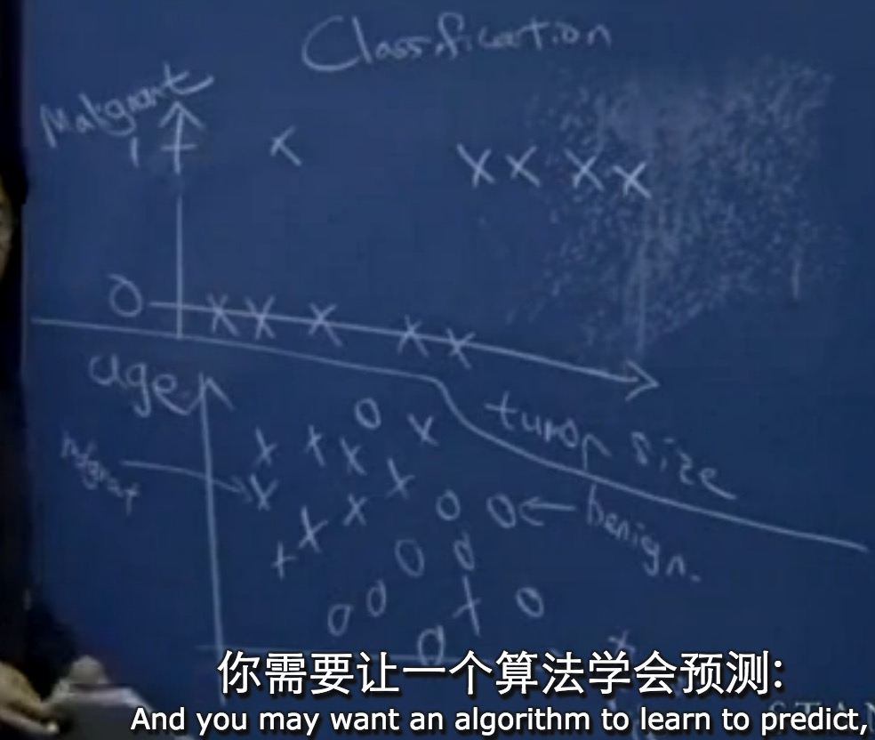

# Andrew Ng机器学习课程01

### 机器学习的定义

机器学习起源于人工智能，我们不能通过一段程序就能使得计算机能够读我们的手写字，自动驾驶飞机，相反，需要一种学习型的算法，让计算机自己学习。

学习型算法举例，读信封上的邮编，处理支票上的手写数字， 个性化推荐

**先修：**

计算机科学的基本知识，数据结构知识，O符号
概率统计：随机变量，均值，方差
线性代数：矩阵，向量，矩阵乘法，逆矩阵

### 课程的4个方面

**监督学习supervised learning**

* 回归问题regression
* 分类问题classification

收集一组房价数据（面积-价格），然后让你预测某面积售价多少。
一种方法是在收集的数据点画一条直线，然后对应某个点，或者其他拟合更好的曲线

之所以称为监督学习，是因为我们为这个算法提供了一个数据集，给了一组标准答案，这类问题属于回归（regression），因为数据是连续的，另一类问题是分类（classification）问题，要处理的变量是离散的，如肿瘤大小决定是否恶性肿瘤，在分类问题中考虑的变量可以是多个，如肿瘤大小和年龄共同决定的是否恶性肿瘤，现在要让算法预测给定一个病人，肿瘤恶性还是良性？

**学习理论learning theory**

如何让一个学习型算法给出的预测达到一定的精度？以及至少需要多少数据集？给出的训练集是否以及足够多？

懂机器学习的人和不懂机器学习的人在能力上有很大的差别

Andrew Ng说不仅是教机器学习的理论知识，而且需要把这些算法用于解决实际的问题，把这些知识用好

**无监督学习**

给你一组数据，没用他们的任何正确答案，然后问你你能在这些数据中找出一些有趣的结构吗？

* 基因分组 
* 如聚类（clustering ）问题，可以对图像的像素进行聚类，独立组件分析，通过读取图片创造3D场景，计算机集群，社交网络分析，航天数据分析
* 鸡尾酒聚会问题，区分不同的音源（使用MATLAB只需一行代码）
* ICA算法

**强化学习reinforcement**

在前面的癌症预测中，进来一个病人然后根据特征，决策给出一个结论，要么对要么错。而在强化学习中，通常会在一段时间内做一系列的决策，只要连续做一些还不错的决策就是好的

* 强化学习的背后是**回报函数**的概念，“good dog”,"bad dog" ，控制然后获得好的回报 
* 找到一种方式定义什么是好的行为
* 然后用一个学习型算法，得到更多的回报和更少的惩罚
* 用在：机器人，网页爬取， 

vonzhou 2016.3.9 看了2遍