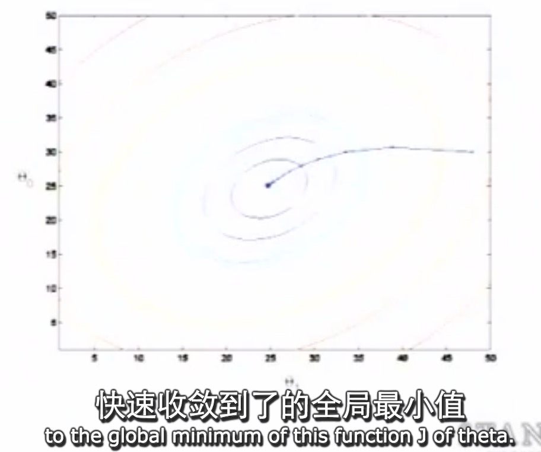

# 梯度下降
---

cs299 lecture 2

今天讲：

* 线性回归 Linear regression
* 梯度下降 Gradient descent
* 正规方程组 Normal equations

看lecture note学习详细的公式推导

视频：自动驾驶汽车Alvin，15年前的例子，CMU，监督学习（人司机提供了一系列正确的驾驶方向 ），神经网络算法，核心是梯度下降。是一个回归问题，因为是一系列连续变量

引入一些符号

* m 训练样本的数目
* x 输入变量，也称为特征（features）
* y 输出变量，也称目标变量 target varible
*（x, y） 表示一个训练样本 one training example
* 第i个训练样本 $$ (x^{(i)}, y^{(i)}) $$
 
在监督学习中，由给的m大小的训练集， 通过我们的算法生成一个函数h， 这个函数称为假设（hypothesis，历史原因），这个假设的任务就是接受某个输入，产生相应的预测估计 

线性表示： $$ h(x) = \theta_0 + \theta_1x$$

通常情况下，回归问题都是有多个输入变量，比如房屋的面积（x1）和卧室的数量(x2)共同影响房价

此时有，$$ h(x) = h_\theta(x) = \theta_0 + \theta_1x_1 + \theta_2x_2 $$

为了表达的简洁定义 X0 = 1

$$ h(x) = h_\theta(x) = \theta_0x_0 + \theta_1x_1 + \theta_2x_2  \\
   h(x) = \sum_{i=0}^{2}\theta_ix_i = \theta^Tx
$$

定义n=特征的个数， $$  h(x) = \sum _{i=0} ^{n}\theta_ix_i$$

$$\theta$$称为参数，学习算法的任务就是通过训练集求得这样的参数

 现在看房价预测问题，选定怎样的参数theta，让算法做出准确的预测呢？
 
 一种合理的方法就是让预测和正确的答案之间的误差尽可能小，问题转化为要使得一个关于theta的函数取得最小值
 
 $$min_\theta \frac{1}{2} \sum_{i=1}^{m}(h_\theta(x^i)^2 - (y^i)^2) \\
 J(\theta) = \frac{1}{2} \sum_{i=1}^{m}(h_\theta(x^i)^2 - (y^i)^2) \\
 就是要求 minimize_\theta J(\theta)
 $$
 
下面讲几个求取最小值的算法

搜索算法：先给参数一些初始值，如 theata向量 = 0， 然后不断的改变 theta 使得 J(theta)减小，直到我们满怀希望的找到了使得其取最小值的theta

为了找到最小值，一种方法是梯度下降，就是总是沿着下降最快的方向下山， 最终到达函数的局部最小值，换不同的起始点可能会到达不同的局部最优值

梯度下降：

$$
\theta_i := \theta_i - \alpha\frac{\partial}{\partial\theta_i} J(\theta) 不断迭代求得第i个参数  \\
应用到我们的问题中  \\
如果只有一组训练数据  \frac{\partial}{\partial\theta_i} J(\theta) = \frac{\partial}{\partial\theta_i} \frac{1}{2} (h_\theta(x) - y)^2 \\
 =  (h_\theta(x) - y) \frac{\partial}{\partial\theta_i}(h_\theta(x) - y)  \\
 =  (h_\theta(x) - y) \frac{\partial}{\partial\theta_i}(\theta_0x_0 + \theta_1x_1 + ..+ \theta_ix_i + ... + \theta_nx_n - y)  \\
 = (h_\theta(x) - y)x_i \\
 这样我们得到了学习规则(learning rule)\\
 \theta_i := \theta_i - \alpha(h_\theta(x) - y)x_i \\
 \\
$$
 
注意alpha称为学习的速度 learning rate, 控制你的步子迈的有多大，通常手动设置， 设置的越小，朝着最陡峭方向每次迈很小的一步， 会花很长时间去收敛

重复以下算法，直到收敛（这里是m个样本，而非一个）

$$
\theta_i := \theta_i - \alpha\frac{\partial}{\partial\theta_i} J(\theta) \\
 \theta_i := \theta_i - \alpha \sum_{j=1}^{m} (h_\theta(x^{(j)}) - y^{(j)}) x_i 
$$
 
 
J(theta)不会太复杂，通常是平方函数，所以不会存在多个最优解.梯度下降的过程中步子会越来越小，因为达到局部最优的时候梯度是0.

最小二乘拟合least square fit

上述算法称为 batch gradient descent ，batch指的是每次迭代都需要巡视整个训练集，not
 good当m很大的时候。 所以有另一个alternative方法，叫随机梯度下降 statistic gradient descent,也称增量梯度下降， 如下图，这个方法的好处是， 使用一次训练样本就可以更新一次参数（使用当前第j个样本），无需在调整参数之前遍历所有的训练集，对于大规模数据集，随机梯度下降通常会快很多，但是随机梯度下降不会精确的收敛到全局最优点，中途可能会徘徊
 
 
 
 
 接下来引入矩阵表示的符号
 
 定义J(theta)对theta偏导数的矩阵向量
 
 
 
 定义函数f从M x N的矩阵A映射到实数空间，然后是f关于矩阵A的导数，也是一个矩阵，是f关于A中每个元素的偏导数。如果A是一个方阵，A的迹是对角元素之和，迹是一个实数
 
 
 
 
 关于迹的一些规律，后面会用到：
 
 
 
   
 
 下面利用上面的工具，进行推导
 
 X称为设计矩阵（design matrix）， 矩阵与其转置的内积是实数，最终会得到对J(theta)的定义，样本个数m是从1到m，特征向量（参数个数）是从0到n，
 
  
  
 
 
 
   
现在要求最小值，让导数设置为0，矩阵与其转置的内积是实数，在这里就等于迹trace,

最终得到了正规等式（normal equation），使用矩阵符号，就不需要上面那样的迭代过程，

需要恶补的知识：

* 梯度下降
* 矩阵转置的展开 
* 矩阵迹

[PDF](README.pdf)

vonzhou 2016.3.10  3 hours

   

 

 

